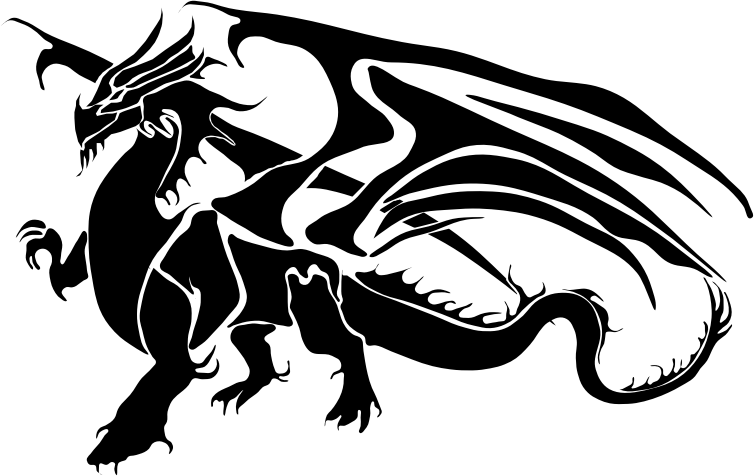

# [The Expression Problem and Scala Typeclasses](https://github.com/ASRagab/the-expression-problem-typeclasses)

---

### Philip Wadler


---

### 12 November 1998

Definition
> The goal is to define a datatype by cases, where one can add new cases to the
> datatype and new functions over the datatype, without recompiling
> existing code, and while retaining static type safety (e.g., no
> casts).

---

### Example Problem

|           | Logistic Regressor | DecisionTree Regressor|
|-----------|--------------------|-----------------------|
| fit()     |                    |                       |
| predict() |                    |                       |
|           |                    |                       |

---?code=code/src/main/java/interfaces/Algo.java&lang=java&title="The Interface"
---?code=code/src/main/java/implementations/DecisionTreeRegressor.java&lang=java&title="The Implementation"
---?code=code/src/main/java/implementations/LinearRegressor.java&lang=java&title="The Other Implementation"

---

### Ship it!

|  v0.0.1   | Logistic Regressor    | DecisionTree Regressor|
|-----------|-----------------------|-----------------------|
| fit()     | @fa[check fa-lime]    | @fa[check fa-lime]    |
| predict() | @fa[check fa-lime]    | @fa[check fa-lime]    |
|           |                       |                       |

---

### v0.0.2 ...K-Means Clustering

|  v0.0.2   | Logistic Regressor    | DecisionTree Regressor|  KMeansRegressor |
|-----------|-----------------------|-----------------------|------------------|
| fit()      | @fa[check fa-lime]   | @fa[check fa-lime]    |                  |
| predict() | @fa[check fa-lime]    | @fa[check fa-lime]    |                  |
|           |                       |                       |                  |

---?code=code/src/main/java/implementations/KMeansRegressor.java&lang=java&title="Add Another Implementation FTW!"

---

### So much winning!

|  v0.0.2   | Logistic Regressor    | DecisionTree Regressor|  KMeansRegressor |
|-----------|-----------------------|-----------------------|------------------|
| fit()     | @fa[check fa-lime]    | @fa[check fa-lime]    |@fa[check fa-lime]|
| predict() | @fa[check fa-lime]    | @fa[check fa-lime]    |@fa[check fa-lime]|
|           |                       |                       |                  |

---

### v0.0.3 ...Add Score (Mean Accuracy)

|  v0.0.3   | Logistic Regressor    | DecisionTree Regressor|  KMeansRegressor |
|-----------|-----------------------|-----------------------|------------------|
| fit()     | @fa[check fa-lime]    | @fa[check fa-lime]    |@fa[check fa-lime]|
| predict() | @fa[check fa-lime]    | @fa[check fa-lime]    |@fa[check fa-lime]|
| score()   |                       |                       |                  |

---

### Here Be



---

### Inexpressivity of the First Kind

```java
package interfaces;

public interface Algo {
     void fit();
     void predict();
     double score();
}

```

@[6](Requires a reopening of the interface, not always possible)
@[8](Requires a reopening of each class and adding new behavior)

---

### Pull the Chord!

|  v0.0.3   | Logistic Regressor  | Decision Tree Regressor|  KMeans Regressor |
|-----------|--------------------|--------------------|------------------------|
| fit()     | @fa[check fa-lime] | @fa[check fa-lime] | @fa[check fa-lime]     |
| predict() | @fa[check fa-lime] | @fa[check fa-lime] | @fa[check fa-lime]     |
| score()   | @fa[exclamation-triangle fa-orange] | @fa[exclamation-triangle fa-orange] | @fa[exclamation-triangle fa-orange] |

In traditional *inheritance based* OOP adding new behaviors is difficult

---

### Functional Approach

```haskell

data Algo = LogisticRegressor | DecisionTreeRegressor
            | KMeansRegressor

fit :: Algo -> ()
fit LogisticRegressor = {...}
fit DecisionTreeRegressor = {...}
fit KMeansRegressor = {...}

predict :: Algo -> ()
predict LogisticRegressor = {...}
predict DecisionTreeRegressor = {...}
predict KMeansRegressor = {...}

score :: Algo -> ()
...

```

---


---

### All Green

|  v0.0.3   | Logistic Regressor | Decision Tree Regressor | KMeansRegressor    |
|-----------|--------------------|-------------------------|--------------------|
| fit()     | @fa[check fa-lime] | @fa[check fa-lime]      | @fa[check fa-lime] |
| predict() | @fa[check fa-lime] | @fa[check fa-lime]      | @fa[check fa-lime] |
| score()   | @fa[check fa-lime] | @fa[check fa-lime]      | @fa[check fa-lime] |

---

### v0.0.4 and Inexpressivity of the Second Kind

| v0.0.4    | Logistic Regressor | Decision Tree Regressor | KMeans Regressor   | ElasticNet Regressor |
|---------- |--------------------|-------------------------|--------------------|----------------------|
| fit()     | @fa[check fa-lime] | @fa[check fa-lime]      | @fa[check fa-lime] |                      |
| predict() | @fa[check fa-lime] | @fa[check fa-lime]      | @fa[check fa-lime] |                      |
| score()   | @fa[check fa-lime] | @fa[check fa-lime]      | @fa[check fa-lime] |                      |

---

### Reopening the Type

```haskell
data Algo = LogisticRegressor | DecisionTreeRegressor
    | KMeansRegressor | ElasticNetRegressor

fit :: Algo -> ()
-- 
fit ElasticNetRegressor = {...}

predict :: Algo -> ()
--
predict ElasticNetRegressor = {...}

score :: Algo -> ()
--
score ElasticNetRegressor = {...}

```

@[1,2,6,10,14](We now have to touch every implementation, also not always possible)

---

### Are we having fun yet?

| v0.0.4 | Logistic Regressor | Decision Tree Regressor | KMeans Regressor | ElasticNet Regressor
|-----------|--------------------|--------------------|---------------------|--------------------|
| fit() | @fa[check fa-lime] | @fa[check fa-lime] | @fa[check fa-lime] | @fa[exclamation-triangle fa-orange] |
| predict() | @fa[check fa-lime] | @fa[check fa-lime] | @fa[check fa-lime] | @fa[exclamation-triangle fa-orange] |
| score()   | @fa[check fa-lime] | @fa[check fa-lime] | @fa[check fa-lime] | @fa[exclamation-triangle fa-orange] | 

---

### Extensibility in Two Directions


---

### Solution Criteria

- Minimize Recompilation of Existing Code |
- Static Typesafety - Avoid Casting |
- Avoid Duplication and Modification |

---

### Choose Your Fighter!

- Visitor Pattern - Java
- Open Classes/Monkey Patching - Ruby
- Multimethods - Clojure

---

### Choose your Battlefield!

- Canonical Expression Interpreter
  - The domain (expressions and interpretations) is the problem writ small

---

### The Visitor Pattern

@fa[arrow-down fa-lime]
+++

### The Visitor Interface

```java
package visitor.interfaces;

import visitor.impl.expressions.BinaryAddition;
import visitor.impl.expressions.Literal;

public interface Visitor<T> {
    T visit(Literal l);
    T visit(BinaryAddition b);
}

```

@[7-8](a visitor will need to visit every type of expression in the heirarchy)

+++

### The Visitable Interface

```java
package visitor.interfaces;

public interface Visitable {
   /* The accept method on a visitable i.e. a type on the expression heirarchy, 
    is the secret sauce it allows an independent operation defined elsewhere 
    "access" to the type to perform the action */
    <R> R accept(Visitor<R> v);


```

@[7](Many Bracket, Such R!)

+++

### An Implemented Visitable

```java
package visitor.impl.expressions;

import visitor.interfaces.Visitable;
import visitor.interfaces.Visitor;

public class Literal implements Visitable {
    private int value;

    public int getValue() {
        return value;
    }

    public Literal(int v) {
        this.value = v;
    }

    @Override
    public <T> T accept(Visitor<T> v) {
         return v.visit(this);
    }
}

```

@[17-21](Mostly POJO boilerplate sans the `accept` method, which takes `this` providing the visitor access to the object)

+++

### The Implemented Visitor

```java
package visitor.impl.visitors;

import visitor.impl.expressions.BinaryAddition;
import visitor.impl.expressions.BinaryMultiplication;
import visitor.impl.expressions.Literal;
import visitor.interfaces.Visitor;

public class ShowVisitor implements Visitor<Void> {
    @Override
    public Void visit(Literal l) {
        System.out.print(l.getValue());
        return null;
    }

    @Override
    public Void visit(BinaryAddition b) {
        System.out.print("(");

        b.getLhs().accept(this);
        System.out.print(" + ");
        b.getRhs().accept(this);

        System.out.print(")");
        return null;
    }
}

```

@[8](Sorry for the `Void` type hackery)
@[19, 21](Note the call to `accept`, which will allow the visitor to "recursively" visit sub-expressions)

+++

### Consuming Code

```java
package visitor;

import visitor.impl.expressions.BinaryAddition;
import visitor.impl.expressions.BinaryMultiplication;
import visitor.impl.expressions.Literal;
import visitor.impl.visitors.EvaluateVisitor;
import visitor.impl.visitors.ShowVisitor;

public class RunVisitor {
    public static void main(String[] args) {
        Literal l = new Literal(5);
        Literal r = new Literal(10);

        BinaryAddition b = new BinaryAddition(l, r);
        b.accept(new ShowVisitor());
        System.out.print(" = " + b.accept(new EvaluateVisitor()));
    }
}

```

@[15,16](Would probably wrap up in helper methods but yes, now you give a visitor of your choosing to the expression)

+++?code=code/src/main/java/visitor/impl/expressions/BinaryMultiplication.java&lang=java&title="Adding a type, still pretty easy...."

+++?code=code/src/main/java/visitor/interfaces/Visitor.java&lang=java&title="But now..."
@[10](I do need to open the visitor interface)

+++?code=code/src/main/java/visitor/impl/visitors/ShowVisitor.java&lang=java&title="Showing for Binary Multiplication"
@[28-38](And define the operation in all the visitors for new type)

+++?code=code/src/main/java/visitor/impl/visitors/EvaluateVisitor.java&lang=java&title="Adding a whole new kind of behavior...free"
@[9](This can be added and defined for any type currently in the heirarchy anywhere you want)

---

### Open Classes/Monkey Patching - Ruby

@fa[arrow-down fa-lime]

+++

### Data and Behavior

```ruby
class Literal < Struct.new(:value)
    def show
        print value
    end
end

class BinaryAddition < Struct.new(:lhs, :rhs)
    def show
        lhs.show
        print ' + '
        rhs.show
    end
end

```

@[1-13](Disclaimer: These are the first lines of Ruby I have ever written)
+++

### Adding Data

```ruby
class Negative <  Struct.new(:expression)
    def show
        print ' - ('
        expression.show
        print ')'
    end
end

```

@[1](Yup, not a problem...)
+++

### Adding Behavior

```ruby
require_relative '../Literal'

-- Defined anywhere
module ExpressionExtensions
  refine Literal do
    def evaluate
      value
    end
  end

  refine BinaryExpression do
    def evaluate
      lhs.evaluate + rhs.evaluate
    end
  end

  refine Negative do
    def evaluate
      -expression.evaluate
    end
end

```

@[4](This scoped monkeypatching with refinements is a safer version of the open class pattern, but potentially still brittle)

+++

### Consuming Code (Ruby)

```ruby
require_relative 'modules/expression_extensions'
require_relative 'Literal'

class Run
  using ExpressionExtensions
  def go
    c = Literal.new(10)
    c.show

    l = Literal.new(25)
    r = Literal.new(100)

    print "\n"
    b = BinaryExpression.new(l, r)
    b.show
    print ' = '
    b.evaluate
  end
end

Run.new.go
```

@[5](The only additional requirement is the use of a `using`)

+++

### Pros

- This is extremely extensible |
- Minimal boilerplate |

+++

### Cons

- Easy, it seems, to abuse |
- Leaky: methods already called at the definition site are not refined at the call site |

- <span style="font-size:0.5em; color:#ffffff">something...programming without types...something, something...science without units</span> |

---

### Clojure - Multimethods

@fa[arrow-down fa-lime]
+++

### Data

Some LISPs have them but they are particularly well executed in Clojure

```clojure
; Data
(defrecord Literal [value])
(defrecord BinaryAddition [lhs rhs])
```

@[2](`defrecord` is a runtime macro to create a simple data class or value class, struct-like)

+++

### Behavior

Each implementation dispatches on the type and performs the operation (close to Haskell here)

```clojure
; Here 'class' refers to the built-in function clojure.core/class
(defmulti show class)

; the macro has the name "method" that should tip you off about
; what this is when the jvm gets involved
(defmethod show Literal
  [lit] (str (:value lit)))

(defmethod show BinaryAddition
  [ba] (clojure.string/join " + " [(show (:lhs ba)) 
                                   (show (:rhs ba))]))
; are you feeling these parens yet!!!
```

@[6, 9](if show exists I ~~sits~~ ...sorry "dispatch")
+++

### New Behavior

```clojure
(defmulti evaluate class)

(defmethod evaluate Literal
  [lit] (:value lit))

(defmethod evaluate BinaryAddition
  [ba] (+ (evaluate (:lhs ba))
          (evaluate (:rhs ba))))
```

@[1](Can be defined anywhere types and behaviors are orthogonal to each other in Clojure)

+++

### New Data and its Behaviors

```clojure
(defrecord Negative [expr])

; Behavior for Data, we do not need to redefine `defmulti`
(defmethod show Negative
 [n] (str "-(" (show (:expr n)) ")")

(defmethod evaluate Negative
 [n] (* -1 (evaluate (:expr n))))
```

@[1-8](We can add new ops without touching any existing code. We can also add new types without touching any existing code)

+++

### Consuming Code (Clojure)

```clojure
; on the repl
user=> (show (->Literal 1.3))
"1.3"

user=> (evaluate (->BinaryAddition (->Literal 1.4) (->Literal 1.6)))
3.0

user=> (evaluate (->Negative (->Literal 5)))
-5

user=> (show (->Negative (->BinaryAddition (->Literal 10) (->Literal 10))))
"-(10 + 10)"
```

@[2](The "->" is the `defrecord` parameter constructor syntax/there is a map syntax too!)

+++

### Clojure: the best language you will (probably) never use

This is easy in Clojure and other LISPs that have multimethods because of _open methods_, that is method definitions are not tied to a type/class/file they operate upon the type, thus they do not require awareness of the implementation or access to the code

- <span style="font-size:0.6em; color:#ffffff"> In all seriousness, Clojure is a elegant language inelegantly tooled</span> |

---

### Basic Scala Machinery

- Implicits

<br>
@fa[arrow-down fa-lime]

+++

### Implicits: the thing that makes Scala, Scala

- Line 187 of the Predef Object, a helpful comment!

```scala
  @inline def implicitly[T](implicit e: T) = e // for summoning implicit values from the nether world
```

+++

### Simple Example

```scala
object App {
 /******* implicit conversion ********/

  class Result(v: Integer) {
     def get: Integer = v
     //explicitly using java.lang.Integer
  }

  implicit class ResultOps(r: Result) { 
    // Type "enrichment" or in a less woke time "Pimping"
    def getOpt: Option[Integer] = Option(r.get)
  }

  def consume(bad: Result) = {
    val better = bad.getOpt
    better
  }

  consume(new Result(null)).fold(ifEmpty = 2)(_ + 4) // 2
  consume(new Result(10)).fold(ifEmpty = 2)(_ + 4) // 14

  /******* implicit parameter ********/

  implicit val nullConverter: Result => Integer =
    x => if (x.get == null) 2 else x.get


  def consumeRaw(x: Result)(implicit converter: Result => Integer): Integer = {
    converter(x)
  }

  consumeRaw(new Result(null)) // 2
  consumeRaw(new Result(10)) // 10
}

```

+++

### Implicits: parameters vs. conversions

- Two very closely related features *implicit parameters* and *implicit conversions*
- Both invoke machinery to resolve type errors discovered by attempting to find supplemental info in scope

+++

### Implicit Parameters

- When a method fails to have all the required arguments passed to it

+++

### Implicit Conversions

- When a type fails to have the right shape or doesn't match the expected type

+++

### Enter the 25 Compiler Phases

- One phase of the compiler "the namer" assigns symbols to the parsed syntax tree created in the previous phase called "the parser" |
- "the typer" (where like most of the heavy lifting happens) checks to see if those symbols "type checks" |
- This is where implicits are summoned and wrap the symbol or type in a way that it allows it to typecheck |

+++

### Implicits are...subtle

- An implicit needs to be brought into scope __only once__ |
- The tradeoff is that there must be __exactly__ one implicit of the right type into that scope |

+++

### What is a typeclass? It's a design pattern.

- A pattern that consists of the use of one or more parameterized traits, concrete instances of that trait and the appropriate implicits

+++

### Back to the Expression Interpreter

+++

### Data

```scala
trait Exp
case class Literal(value: Int) extends Exp
case class BinaryAddition[A <: Exp, B <: Exp](left: A, right: B) extends Exp
```

+++

### Behavior

```scala
// Typeclass Behavior Trait
trait Eval[A] {
    def eval(a: A): Int
    }

object Evaluator {
// Typeclasses instances
  implicit def LiteralEval =
      new Eval[Literal] {
          override def eval(a: Literal) = a.value
          }

  implicit def BinaryAdditionEval[A <: Exp, B <: Exp](implicit evA: Eval[A], evB: Eval[B]) =
      new Eval[BinaryAddition[A, B]] {
          override def eval(expr: BinaryAddition[A, B]) = evA.eval(expr.left) + evB.eval(expr.right)
          }
}
```

@[8, 13](Lift each datatype you would like to exhibit a particular behavior into the typeclass context)
@[13](We need a second level implicit to find evidence that A and B can be 'evaled')

+++

### Consuming Code (Scala)

```scala
import Evaluator._ //bring implicits into scope
val l1 = Literal(5)
val l2 = Literal(10)
val add = BinaryAddition(l1, l2)

LiteralEval.eval(l1) // okay
BinaryAdditionEval[Literal, Literal].eval(add) // eh....not great!
```

@[7](The call site is a little busy...we'll fix that shortly)

+++

### New Data

```scala
case class Negative[A <: Exp](expr: A) extends Exp

object NegativeEvaluator {
    implicit def NegativeEval[A <: Exp](implicit ev: Eval[A]) = new Eval[Negative[A]] {
        override def eval(a: Negative[A]): Int = -ev.eval(a.expr)
    }
}

import NegativeEvaluator._ //bring implicits into scope
val neg = Negative(add)
NegativeEval[BinaryAddition[Literal, Literal]].eval(neg) // this is getting out of hand
```

+++

### New Behavior

```scala
trait Show[A] {
  def show(a: A): String
}

object Shower {
  implicit def LiteralShower = new Show[Literal] {
      override def show(a: Literal): String = s"lit ${a.value}"
      }

  implicit def BinaryAdditionShower[A <: Exp, B <: Exp](implicit evA: Show[A], evB: Show[B]) =
      new Show[BinaryAddition[A, B]] {
        override def show(a: BinaryAddition[A, B]) =
          "(" + evA.show(a.left) + " + " + evB.show(a.right) + ")"
      }

  implicit def NegativeShower[A <: Exp](implicit ev: Show[A]) =
      new Show[Negative[A]] {
        override def show(a: Negative[A]) = "-" + "(" + ev.show(a.expr) + ")"
      }
}

import Shower._ //bring implicits into scope
LiteralShower.show(l1)
NegativeShower[BinaryAddition[Literal, Literal]].show(neg)
```

+++

### Implicits to the rescue again

```scala
object LowerPriorityImplicits {
    //Enriching the Literal type with new 'syntax'
    implicit class LiteralSyntax(lit: Literal) {
      //def a method which performs the behavior
      def evaluate(implicit ev: Eval[Literal]) = {
        ev.eval(lit)
      }

      def show(implicit ev: Show[Literal]) = {
        ev.show(lit)
      }
    }

    implicit class BinaryAdditionSyntax[A <: Exp, B <: Exp](ba: BinaryAddition[A, B]) {
      def evaluate(implicit ev: Eval[BinaryAddition[A, B]]) = {
        ev.eval(ba)
      }

      def show(implicit ev: Show[BinaryAddition[A, B]]) = {
        ev.show(ba)
      }
    }

    implicit class NegativeSyntax[A <: Exp](neg: Negative[A]) {
      def evaluate(implicit ev: Eval[Negative[A]]) = {
        ev.eval(neg)
      }

      def show(implicit ev: Show[Negative[A]]) = {
        ev.show(neg)
      }
    }
  }
```

+++

### Much cleaner syntax

```scala
import LowerPriorityImplicits._ //bring into scope
l1.evaluate // LiteralEval.eval(l1)
add.evaluate // BinaryAddition[Literal, Literal].eval(neg)

add.show // BinaryAdditionShower[BinaryAddition[Literal, Literal]].show(add)
neg.show // NegativeShower[BinaryAddition[Literal, Literal]].show(neg)
```

@[2, 5](Syntax classes, implicitly "enriching" the type allow us to simply dot off the object)

---

### More advanced solutions

- Final Tagless |
- Object Algebras (Partially working impl in repo) |
- Interpreter Pattern and the Free Monad |

---

### References and Additional Resources

- [Finally Solving the Expression Problem (YouTube)](https://www.youtube.com/watch?v=EsanJ7_U89A)
- [The Expression Problem in Ruby](https://mike-burns.com/project/expression-problem-ruby/expression-problem-ruby-riga.pdf)
- [The Expression Problem and its Solutions](https://eli.thegreenplace.net/2016/the-expression-problem-and-its-solutions)
- [Independently Extensible Solutions to the Expression Problem (Whitepaper)](https://infoscience.epfl.ch/record/52625/files/IC_TECH_REPORT_200433.pdf)
- [Extensibility for the Masses (Whitepaper)](http://www.cs.utexas.edu/~wcook/Drafts/2012/ecoop2012.pdf)
- [Implicit Class: The Machinery Behind the Semantics (YouTube)](https://www.youtube.com/watch?v=dNyoPOyhYpg)
- [Implicits and Type Classes in Scala](https://www.theguardian.com/info/developer-blog/2016/dec/22/parental-advisory-implicit-content)
- [Type Classes in Scala at LX Scala (YouTube)](https://www.youtube.com/watch?v=A5t6WagltAc)
- [Typeclass Traits Proposal (Martin Odersky)](https://github.com/lampepfl/dotty/pull/4153)

---

## Fin

Express Yourself!
